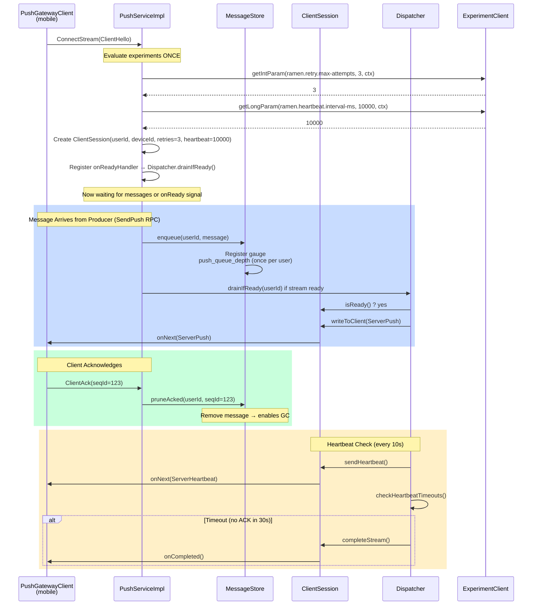
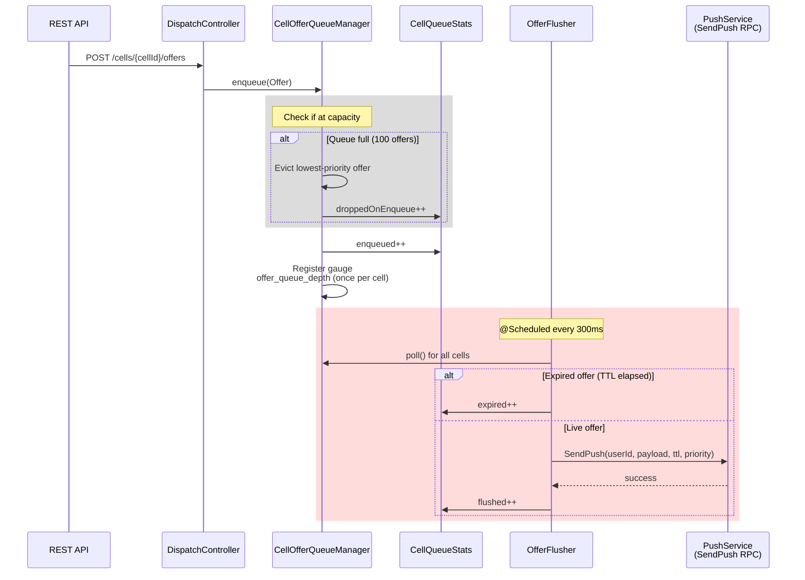
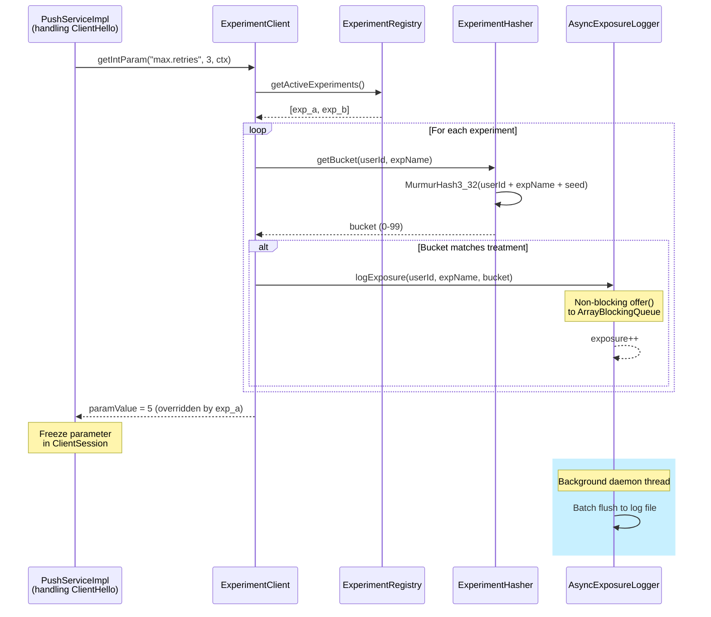
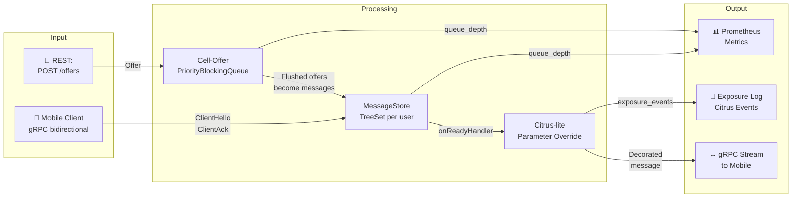

# Cell-Offer Queue Service – Full Architecture

A complete visualization of the three-layer RAMEN-lite push-dispatch system with embedded Citrus-lite experimentation engine.

---

## System Architecture Diagram

```mermaid
graph TB
    subgraph "Client Layer"
        PushGatewayClient["🔌 PushGatewayClient<br/>(Mobile SDK)"]
        ClientCtl["ClientControl"]
    end

    subgraph "gRPC Transport"
        ConnectStream["↔️ ConnectStream<br/>(Bidi gRPC Stream)<br/>ClientToServer / ServerToClient"]
        SendPush["→ SendPush<br/>(Unary RPC)"]
    end

    subgraph "Push Gateway Layer"
        PushServiceImpl["🎯 PushServiceImpl<br/>(gRPC Service)"]
        ConnectionMgr["📋 ConnectionManager<br/>userId → ClientSession"]
        MessageStore["📚 MessageStore<br/>(Immutable Ledger)<br/>Per-user TreeSet + TTL"]
        ClientSession["🔐 ClientSession<br/>ReentrantLock-protected<br/>stream writes"]
        Dispatcher["⚡ Dispatcher<br/>Event-driven drain<br/>via onReadyHandler"]
    end

    subgraph "Citrus-lite (Experimentation)"
        ExperimentClient["🧪 ExperimentClient<br/>getIntParam/getLongParam<br/>< 1ms hot-path"]
        ExperimentRegistry["📊 ExperimentRegistry<br/>Load & validate YAML<br/>Conflict detection"]
        ExperimentHasher["🎲 ExperimentHasher<br/>MurmurHash3_32<br/>Deterministic bucketing"]
        ExposureLogger["📝 AsyncExposureLogger<br/>Non-blocking<br/>ArrayBlockingQueue"]
        ConfigLoader["🔄 ExperimentsConfigLoader<br/>@Scheduled reload<br/>60s poll interval"]
    end

    subgraph "Cell-Offer Layer"
        REST["📨 REST API<br/>POST /cells/{cellId}/offers"]
        DispatchController["🎮 DispatchController<br/>Offer enqueue/stats"]
        CellOfferQueueManager["🗂️ CellOfferQueueManager<br/>ConcurrentHashMap<br/>Per-cell PriorityBlockingQueue"]
        OfferFlusher["⏱️ OfferFlusher<br/>@Scheduled drain<br/>All cells → PushGateway"]
        CellQueueStats["📊 CellQueueStats<br/>enqueued, flushed,<br/>expired, dropped"]
    end

    subgraph "Metrics & Monitoring"
        MicrometerRegistry["📈 Micrometer Registry<br/>Gauges (registered once)<br/>Counters"]
        PrometheusExporter["📊 Prometheus Exporter<br/>/actuator/prometheus"]
    end

    %% Client to gRPC transport
    PushGatewayClient -->|ClientHello<br/>ClientAck<br/>ClientHeartbeat| ConnectStream
    ClientCtl -->|Control flow| PushGatewayClient

    %% gRPC transport to PushServiceImpl
    ConnectStream -->|handleHello<br/>handleAck<br/>handleHeartbeat| PushServiceImpl
    SendPush -->|sendPush| PushServiceImpl

    %% PushServiceImpl orchestration
    PushServiceImpl -->|registerSession| ConnectionMgr
    PushServiceImpl -->|getIntParam<br/>getLongParam<br/>Evaluate once @ hello| ExperimentClient
    PushServiceImpl -->|setOnReadyHandler<br/>register backpressure| Dispatcher
    PushServiceImpl -->|enqueue<br/>pruneAcked| MessageStore

    %% MessageStore and ClientSession
    MessageStore -->|store/retrieve| ClientSession
    ClientSession -->|writeToClient<br/>completeStream<br/>serialized| ConnectStream

    %% Dispatcher event-driven
    Dispatcher -->|drainIfReady<br/>on backpressure| ClientSession
    Dispatcher -->|sendHeartbeats<br/>@Scheduled| ClientSession
    Dispatcher -->|checkHeartbeatTimeouts<br/>@Scheduled| ConnectionMgr

    %% ConnectionManager and ClientSession
    ConnectionMgr -->|manage lifecycle| ClientSession

    %% Citrus-lite evaluation
    ExperimentClient -->|load config| ExperimentRegistry
    ExperimentClient -->|bucket user| ExperimentHasher
    ExperimentClient -->|log exposure| ExposureLogger
    ConfigLoader -->|@PostConstruct<br/>@Scheduled reload| ExperimentRegistry

    %% Cell-offer flow
    REST -->|POST /offers| DispatchController
    DispatchController -->|enqueue| CellOfferQueueManager
    CellOfferQueueManager -->|track stats| CellQueueStats
    OfferFlusher -->|drain & flush<br/>to SendPush| CellOfferQueueManager
    OfferFlusher -->|SendPush RPC| SendPush

    %% Metrics collection
    PushServiceImpl -->|gauge: active_sessions<br/>counter: messages_sent| MicrometerRegistry
    MessageStore -->|gauge: push_queue_depth| MicrometerRegistry
    CellOfferQueueManager -->|gauge: offer_queue_depth<br/>counter: offers_*| MicrometerRegistry
    ExposureLogger -->|counter: exposures| MicrometerRegistry
    MicrometerRegistry -->|scrape| PrometheusExporter

    style PushGatewayClient fill:#e1f5ff
    style PushServiceImpl fill:#fff3e0
    style MessageStore fill:#fff3e0
    style ClientSession fill:#fff3e0
    style Dispatcher fill:#fff3e0
    style ExperimentClient fill:#f3e5f5
    style CellOfferQueueManager fill:#e8f5e9
    style DispatchController fill:#e8f5e9
    style MicrometerRegistry fill:#fce4ec
```

---

## Component Interaction Sequences

### 1. **Client Connection & Message Delivery** (Push Gateway)



### 2. **Cell-Offer Enqueue & Flush** (Cell-Offer Layer)



### 3. **Experiment Evaluation & Exposure Logging** (Citrus-lite)



---

## Data Flow Diagram



---

## Key Invariants & Design Decisions

| Invariant | Implementation | Why |
|---|---|---|
| **At-Least-Once Delivery** | `MessageStore.pollDueMessages()` is read-only for live messages; only `pruneAcked()` removes them | Network drops between dispatch and client receipt → automatic re-delivery on reconnect |
| **Event-Driven Backpressure** | `onReadyHandler` registered in `PushServiceImpl.handleHello()`; no `@Scheduled dispatchAll()` | Mobile backpressure (slow TCP window) is respected; no unbounded heap growth; no CPU waste |
| **Thread-Safe Writes** | `ClientSession.writeToClient()` uses `ReentrantLock` | gRPC worker (handleHello) and scheduler (drainIfReady) may write concurrently; prevents `IllegalStateException` |
| **Gauge Registration Once** | `push_queue_depth` registered in `computeIfAbsent()` (first enqueue); `active_sessions` in constructor | Hot-path gauge registration creates duplicates → OOM in Micrometer registry |
| **Experiment Frozen Per Stream** | Parameters evaluated in `ClientHello`, stored in `ClientSession` | Changing parameters mid-stream violates at-least-once contract; breaks A/B analysis |
| **Parameter Key Conflict Detection** | `ExperimentRegistry` throws `FatalConfigException` if 2+ enabled experiments override the same key | "Last-applied wins" produces silent data corruption; impossible to draw valid conclusions |
| **Deterministic Bucketing** | `ExperimentHasher` uses fixed-seed `MurmurHash3_32` | Changing seed/algorithm mid-experiment reassigns units to different cohorts → invalidates exposure data |
| **Non-Blocking Exposure Logging** | `AsyncExposureLogger` uses `ArrayBlockingQueue.offer()` (non-blocking) | `getParam()` is hot-path; blocking call stalls entire thread pool → cascading latency |
| **Reconnect Backoff Correctness** | `PushGatewayClient.backoffMs` reset only in `handleControl(ServerControl.RESUME_FROM_SEQ)`, not in `connect()` | Resetting in connect() → reconnect storm on instantaneous `Connection refused` |

---

## Metrics & Observability

### Cell-Offer Layer Metrics

| Metric | Type | Labels | Description |
|---|---|---|---|
| `offer_queue_depth` | Gauge | `cellId` | Current pending offers in cell queue |
| `offers_enqueued_total` | Counter | `cellId` | Cumulative offers added |
| `offers_flushed_total` | Counter | `cellId` | Offers successfully sent to PushGateway |
| `offers_expired_total` | Counter | `cellId` | Offers dropped due to TTL expiry |
| `offers_dropped_total` | Counter | `cellId` | Offers rejected at enqueue (queue full) |

### Push Gateway Layer Metrics

| Metric | Type | Labels | Description |
|---|---|---|---|
| `push_queue_depth` | Gauge | `userId` | Pending push messages per user |
| `push_messages_sent_total` | Counter | `userId` | Cumulative messages delivered |
| `active_sessions` | Gauge | _(global)_ | Currently connected mobile clients |
| `session_duration_seconds` | Histogram | `userId` | Time from ClientHello to session close |
| `heartbeat_timeout_total` | Counter | _(global)_ | Sessions terminated due to heartbeat timeout |

### Citrus-lite Metrics

| Metric | Type | Labels | Description |
|---|---|---|---|
| `citrus_exposures_total` | Counter | `experiment_name`, `bucket` | Cumulative exposure events logged |
| `citrus_exposures_dropped_total` | Counter | _(global)_ | Exposure events dropped (queue full) |
| `citrus_config_reload_seconds` | Gauge | _(global)_ | Last config reload duration |
| `citrus_active_experiments` | Gauge | _(global)_ | Number of currently enabled experiments |

---

## Deployment & Configuration

### Key Properties

```properties
# Cell-Offer Layer
cell.offer.max-queue-size=100                    # Max offers per cell
cell.offer.flush-interval-ms=300                 # Flush scheduler interval

# Push Gateway Layer
push.gateway.max-queue-size-per-user=200         # Max pending messages per user
push.gateway.dispatch-batch-size=10              # Messages drained per onReady
push.gateway.heartbeat-interval-ms=10000         # Server heartbeat cadence
push.gateway.heartbeat-timeout-ms=30000          # Session liveness timeout
push.gateway.default-ttl-ms=30000                # Default message TTL

# Citrus-lite
citrus.config.path=                              # Path to experiments.yaml
citrus.config.poll-interval-ms=60000             # Config reload interval
```

### Ports

| Service | Port | Protocol |
|---|---|---|
| HTTP (REST API, Actuator) | `8080` | HTTP |
| gRPC (PushGateway) | `9090` | gRPC/protobuf |
| Prometheus metrics | `8080/actuator/prometheus` | HTTP |

---

## Testing Strategy

Each architectural invariant has a dedicated test class:

| Invariant | Test Class |
|---|---|
| At-least-once (no pre-ack removal) | `MessageStoreAtLeastOnceTest` |
| Gauge registered once per entity | `GaugeMeterRegistrationTest` |
| StreamObserver thread-safety | `ClientSessionThreadSafetyTest` |
| Event-driven dispatch, no polling | `DispatcherEventDrivenTest` |
| Reconnect backoff correctness | `PushGatewayClientReconnectTest` |
| MurmurHash3 determinism | `ExperimentHasherTest` |
| Non-blocking exposure drop contract | `AsyncExposureLoggerTest` |
| Parameter-key conflict detection | `ExperimentRegistryTest` |
| Hot-path evaluation & variant assignment | `ExperimentClientTest` |
| YAML loading & scheduled reload | `ExperimentsConfigLoaderTest` |

---

## Quick Reference: Component Responsibilities

```
CellOfferApplication
  └─ @EnableScheduling
     └─ OfferFlusher
        └─ @Scheduled every 300ms: drain all cell queues → SendPush RPC

PushServiceImpl (gRPC service)
  ├─ handleHello (ClientHello)
  │  ├─ ExperimentClient.getIntParam / getLongParam (ONCE)
  │  ├─ Create ClientSession (with frozen params)
  │  └─ Register onReadyHandler → Dispatcher.drainIfReady
  ├─ handleAck (ClientAck)
  │  └─ MessageStore.pruneAcked()
  ├─ handleHeartbeat (ClientHeartbeat)
  │  └─ Update liveness timestamp
  └─ sendPush (SendPushRequest)
     ├─ MessageStore.enqueue()
     └─ Dispatcher.drainIfReady() (if stream ready)

Dispatcher
  ├─ drainIfReady(userId)  [EVENT-DRIVEN: called from onReadyHandler]
  │  ├─ Check ClientSession.isReady()
  │  └─ ClientSession.writeToClient(ServerPush)
  ├─ @Scheduled sendHeartbeats()
  └─ @Scheduled checkHeartbeatTimeouts()

MessageStore
  ├─ enqueue() – append to TreeSet, register gauge once
  ├─ pollDueMessages() – read-only for live messages
  └─ pruneAcked() – only deletion path

ExperimentClient
  ├─ getIntParam(key, defaultValue, context)
  │  ├─ Look up active experiments
  │  ├─ Bucket user via ExperimentHasher
  │  └─ Log exposure (non-blocking offer())
  └─ getLongParam(key, defaultValue, context)
```

---

## References

- **AGENTS.md** – Architectural invariants & design decisions
- **RAMEN** – Uber's Reliable Async Messaging with Exactly-N delivery
- **Citrus-lite** – Embedded A/B/N testing engine with dynamic config reload
- **Micrometer** – Dimensional metrics with Prometheus exporter
- **gRPC** – Bidirectional streaming with backpressure via `setOnReadyHandler`

